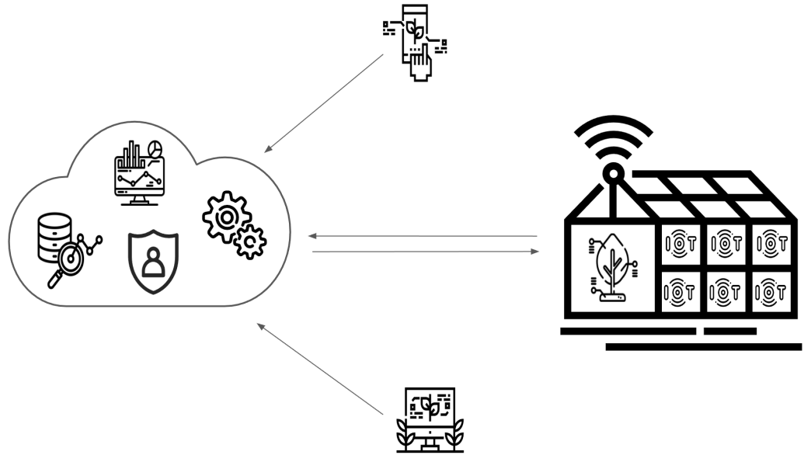

# Ejercicio Cyber Kill Chain – Ataque

# Alumno

**Lic. Martín Lacheski**  
📡 Especialización en Internet de las Cosas (IoT)  
🏛️ Universidad de Buenos Aires (UBA)  

---

# Ejercicio Cyber Kill Chain – Ataque

## 🔍 **Descripción**

Este ejercicio muestra un ataque basado en la metodología **Cyber Kill Chain**, enfocado en vulnerar la instancia de **EC2** que aloja el backend (FastAPI), frontend (React) y la base de datos (MongoDB) del sistema de monitoreo y gestión remota del clima en invernaderos. El ataque utiliza técnicas de **explotación de vulnerabilidades en la instancia EC2** y **acceso no autorizado a la base de datos** para manipular los datos de los sensores y actuadores.

El repositorio con el código del proyecto es:  https://github.com/martinlacheski/EnviroSenseIoT




---

## 🔧 **Sistema Víctima**

El sistema de monitoreo y gestión remota del clima en invernaderos está compuesto por:

- **Dispositivos IoT**: sensores y actuadores conectados a una red Wi-Fi en la Facultad de Ciencias Forestales.
- **Servidor MQTT**: AWS IoT Core, que gestiona la comunicación entre los dispositivos IoT y el backend.
- **Backend**: FastAPI, que procesa las solicitudes y gestiona la base de datos.
- **Frontend**: React, que permite a los usuarios monitorear y controlar el sistema de forma remota.
- **Base de datos**: MongoDB, que almacena los datos de los sensores y actuadores.
- **Infraestructura**: Todo el sistema está alojado en una instancia de EC2 en AWS.

---

## 🎯 **Objetivo del Ataque**

Mi objetivo es **comprometer la instancia de EC2** para manipular los datos de los sensores y actuadores, afectando la producción de los invernaderos. Esto lo lograré:

1. **Explotando una vulnerabilidad en el backend (FastAPI)** para obtener acceso no autorizado a la instancia de EC2.
2. **Accediendo a la base de datos (MongoDB)** para manipular los datos de los sensores y actuadores.
3. **Desactivando los actuadores** que controlan el riego y la ventilación, provocando un desequilibrio en las condiciones climáticas del invernadero.

---

## 💥 **Resolución del Ataque: Cyber Kill Chain**

### 1 - **Reconnaissance (Reconocimiento)**

**Técnicas utilizadas:**

- *T1595.001* – Active Scanning: Scanning IP Blocks  
  https://attack.mitre.org/techniques/T1595/001/

- *T1596.001* – Search Open Technical Databases: Domain Properties  
  https://attack.mitre.org/techniques/T1596/001/

**Pasos realizados:**

- Realizo un escaneo de la red Wi-Fi de la Facultad de Ciencias Forestales utilizando herramientas como **Nmap** para identificar dispositivos IoT y la instancia de EC2.
- Utilizo **Shodan** y **Censys** para obtener información sobre la instancia de EC2, como la dirección IP pública, puertos abiertos y servicios en ejecución.
- Identifico que el backend (FastAPI) está expuesto en el puerto 8000 y que no tiene autenticación robusta en algunos endpoints.

---

### 2 - **Weaponization (Armado del Ataque)**

**Técnicas utilizadas:**

- *CWE-352* – Cross-Site Request Forgery (CSRF)  
  https://cwe.mitre.org/data/definitions/352.html

- *CWE-77* – Command Injection  
  https://cwe.mitre.org/data/definitions/77.html

**Pasos realizados:**

- Desarrollo un **script en Python** que automatiza la explotación de una vulnerabilidad de inyección de comandos en el backend (FastAPI).
- Preparo un **payload malicioso** que aprovecha una vulnerabilidad de **deserialización insegura** en el backend para ejecutar comandos en la instancia de EC2.

---

### 3 - **Delivery (Entrega del Ataque)**

**Técnicas utilizadas:**

- *T1190* – Exploit Public-Facing Application  
  https://attack.mitre.org/techniques/T1190/

- *T1204.002* – User Execution: Malicious File  
  https://attack.mitre.org/techniques/T1204/002/

**Pasos realizados:**

- Envío una solicitud HTTP maliciosa al backend (FastAPI) en el puerto 8000, explotando la vulnerabilidad de inyección de comandos.
- El payload malicioso se ejecuta en la instancia de EC2, permitiéndome obtener acceso no autorizado al sistema.

---

### 4 - **Explotación (Explotación de la Vulnerabilidad)**

**Técnicas utilizadas:**

- *T1059.004* – Command and Scripting Interpreter: Unix Shell  
  https://attack.mitre.org/techniques/T1059/004/

- *T1078* – Valid Accounts  
  https://attack.mitre.org/techniques/T1078/

**Pasos realizados:**

- Una vez dentro de la instancia de EC2, utilizo **credenciales por defecto** para acceder a la base de datos MongoDB.
- Manipulo los datos de los sensores para que el sistema crea que las condiciones climáticas son óptimas, cuando en realidad no lo son.
- Desactivo los actuadores de riego y ventilación, provocando un desequilibrio en las condiciones climáticas del invernadero.

---

### 5 - **Command & Control (C2)**

**Técnicas utilizadas:**

- *T1572* – Protocol Tunneling  
  https://attack.mitre.org/techniques/T1572/

- *T1008* – Fallback Channels  
  https://attack.mitre.org/techniques/T1008/

**Pasos realizados:**

- Configuro un **canal de comunicación cifrado** utilizando **SSH** para mantener el acceso a la instancia de EC2.
- Utilizo un **servidor remoto (C2)** para monitorear el estado del ataque y enviar nuevas instrucciones en caso de que se detecten contramedidas.

---

### 6 - **Actions on Objectives (Acción sobre el Objetivo)**

**Técnicas utilizadas:**

- *T1531* – Account Access Removal  
  https://attack.mitre.org/techniques/T1531/

- *T1498.001* – Network Denial of Service: Direct Network Flood  
  https://attack.mitre.org/techniques/T1498/001/

**Pasos realizados:**

- **Manipulo los datos de los sensores** para que el sistema tome decisiones incorrectas, como regar en exceso o no ventilar cuando sea necesario.
- **Desactivo los actuadores** de riego y ventilación, provocando un desequilibrio en las condiciones climáticas del invernadero.
- **Interrumpo la comunicación** entre los sensores y el servidor MQTT, dejando el sistema inoperable.

---

## 🔀 **Diagrama de Flujos del Ataque**

```
1. [Objetivo] → [Escaneo de la red Wi-Fi y la instancia EC2]
         ⬇
2. [Reconocimiento - Nmap y Shodan]
         ⬇
3. [Weaponization - Script de inyección de comandos]
         ⬇
4. [Delivery - Explotación del backend (FastAPI)]
         ⬇
5. [Explotación - Acceso no autorizado a la instancia EC2]
         ⬇
6. [C2 - Comunicación cifrada mediante SSH]
         ⬇
7. [Acción - Manipulación de datos y sabotaje]
```

---